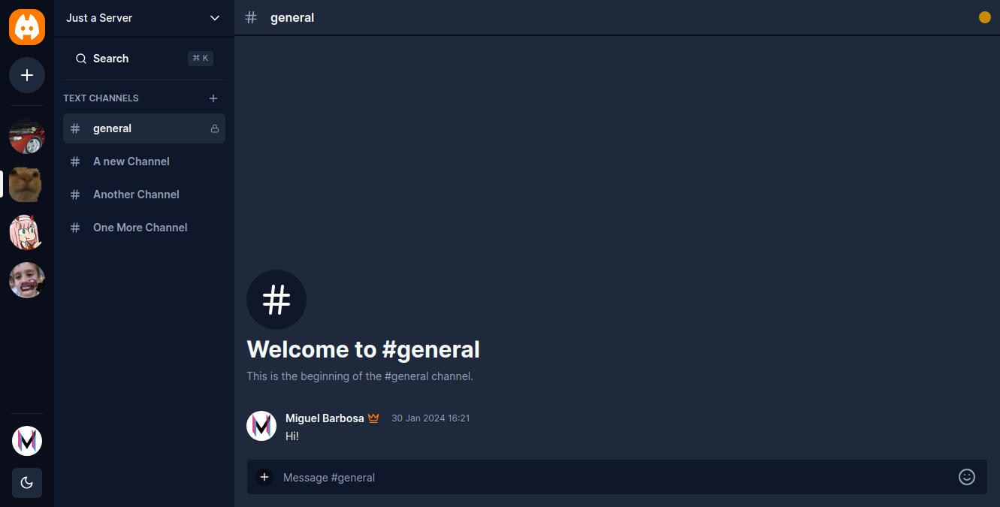

<p align="center">
  
</p>
<div align="center">
  <h1>Discordia</h1>
</div>

<p align="center">
  

  

  

  

  

  
</p>

# About 🔎


Communication app where is possible to create personal servers or enter others servers by invite, also manage members and channels, send private messages to other members or just chat in server channels just like the real Discord.


# How to run 🏃
## Prerequisites
* npm
  ```sh
  npm install npm@latest -g

  ```
* [Uploadthing](https://uploadthing.com) and [Clerk](https://clerk.com) accounts

## Installation

1. Clone the repo
   ```sh
   git clone https://github.com/m1guelsb/discordia.git
   ```
2. Install NPM packages
   ```sh
   npm install
   ```
3. Get the free api keys from [Uploadthing](https://uploadthing.com) and [Clerk](https://clerk.com)

4. Rename the `.env.example` to `.env` and fill the variables with the matching api keys

5. Populate your database with Prisma schemas:
  ```sh
   npx prisma migrate
   ```
6. Run the development server:
  ```sh
   npm run dev
   ```

## License

Distributed under the MIT License. See `LICENSE` for more information.


## Contact

Miguel Barbosa - [@m1guelsb](https://twitter.com/m1guelsb) - email@example.com

Project Link: [https://github.com/m1guelsb/discordia](https://github.com/m1guelsb/discordia)
